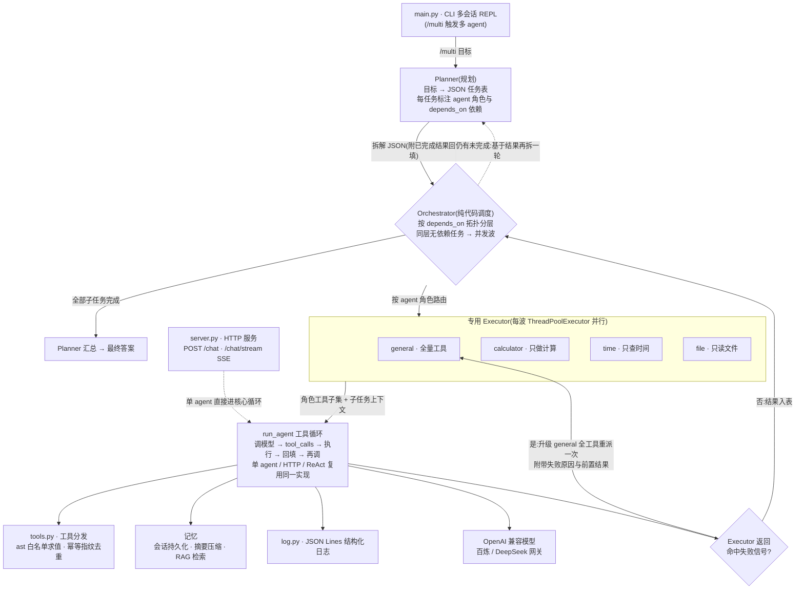

# agent-lab · 从零手写的多范式 Agent

一个不依赖 LangChain 等任何 Agent 框架、从零实现的 agent 系统。工具循环、会话记忆与摘要压缩、
RAG 检索、多 agent 协作、ReAct、幂等去重、流式、结构化日志、HTTP/SSE 服务化、eval 质量层——
每一层都摊开自己实现,不把原理封装进框架抽象里。

三种执行范式(原生 tool calling / Planner+Executor / ReAct)、两级长期记忆、多专用 Executor 协作、
失败自愈重派、拓扑并行、eval 端到端打分。**9 个测试文件全不调 API**(mock 模型),`python evaluate.py` 真调 API 做端到端评测。

---

## 特性

- **单 agent**:原生 tool calling 工具循环,reasoning(Thought)与 tool_calls(Action)双通道合流,流式输出。
- **两级记忆**:会话持久化到 JSON + 摘要压缩(长期记忆)+ 手写向量库 RAG 精确取回细节。
- **多 agent**:Planner 把目标拆成带依赖声明的任务表 → Orchestrator 拓扑分层、同层并行 → 多专用
  Executor(各持最小工具子集,能力最小化);Executor 返回失败信号时自动升级通用角色重派一次。
- **ReAct**:Thought/Action/Observation 纯文本协议循环,与原生 tool calling 对比可见。
- **工具层**:schema 即说明书、`ast` 白名单安全求值、幂等白名单 + 参数指纹去重。
- **工程面**:JSON Lines 结构化日志、FastAPI 一次性 + SSE 流式接口、eval 质量层、mock 模型测试套件。

---

## 快速开始

### 1. 安装与配置

```bash
python -m venv .venv
pip install -r requirements.txt

# Windows: 把 .env.example 复制成 .env,填入 key 后运行自检
# copy .env.example .env
python _check_config.py
```

`.env` 关键项(OpenAI 兼容客户端,网关可换):

| 变量 | 说明 |
|---|---|
| `OPENAI_API_KEY` | 你的模型 key(百炼 `sk-` 开头,或你的网关) |
| `OPENAI_BASE_URL` | 网关地址,如百炼兼容端点 `https://dashscope.aliyuncs.com/compatible-mode/v1` |
| `OPENAI_MODEL` | 模型名,如 `qwen3.7-flash` / `deepseek-v4-flash` |
| `DASHSCOPE_API_KEY` | RAG embedding 用(百炼 `text-embedding-v4`) |

> 大陆直连需代理时,把 `.env.example` 里的 `HTTP_PROXY/HTTPS_PROXY` 打开填你的 Clash 端口。

### 2. 跑起来

```bash
# CLI 多会话 REPL(直接提问走单 agent;/multi 多 agent;/react ReAct;/thinking 显示 Thought)
python main.py

# HTTP 服务(一次性 + SSE 流式)
python -m uvicorn server:app --port 8000
# curl 测试(Windows PowerShell 请用 curl.exe 或 Invoke-RestMethod):
# curl -X POST localhost:8000/chat -H "content-type: application/json" -d '{"question":"现在几点"}'
# curl -N -X POST localhost:8000/chat/stream -H "content-type: application/json" -d '{"question":"现在几点"}'

# eval 端到端打分(真调 API,打印用例级 PASS/FAIL)
python evaluate.py
```

### 3. 测试(不调 API,mock 模型,全绿)

```bash
# Git Bash / Linux / macOS 统一运行全部测试文件
for t in tests/test_*.py; do python "$t"; done

# Windows PowerShell
# Get-ChildItem tests/test_*.py | ForEach-Object { python $_ }
```

逐文件对应:

| 测试文件 | 覆盖 |
|---|---|
| `test_memory.py` | 会话持久化 + 摘要压缩 |
| `test_rag.py` | 手写向量库真测 + RAG 注入 |
| `test_multi.py` | 多agent:拆解/执行/失败自愈/depends_on 并行 |
| `test_react.py` | ReAct 解析器 + 循环 + 去重 |
| `test_reasoning.py` | 合流:reasoning 捕获 + 不回填 |
| `test_streaming.py` | 流式重建 tool_calls |
| `test_dedup.py` | 工具幂等去重 |
| `test_eval.py` | eval 打分逻辑 |
| `test_server.py` | HTTP 层:一次性 + SSE |

---

## 架构

三种范式共享同一个核心循环。下图是多 agent(`/multi`)一次请求的运行时路径——
单 agent(CLI 直接提问 / HTTP `/chat`)只是绕过 Planner 与 Orchestrator,直接进入 `run_agent` 循环;
ReAct 则是用自己的文本协议循环,执行仍走同一套工具层。



**关键设计**:

- **一个核心循环,三种范式复用**:`run_agent` 是唯一的工具执行者。多 agent 的 Executor 不重写循环,
  只是以"角色工具子集 + 角色 system prompt"调用 `run_agent`;ReAct 用自己的文本协议循环,但工具执行、
  日志、幂等去重都复用工具层。分层复用是这套代码能保持小的原因。
- **依赖显式化 + 拓扑并行**:Planner 在任务 JSON 里声明 `depends_on`,Orchestrator 按声明把本批任务
  排成"波"——同波内任务互不依赖 → 线程池并行;依赖跨层 → 波间串行。`stream=True` 时降级串行
  (流式是单通道回调,并发写会交织)。
- **多专用 Executor = 声明式角色注册表**:每个角色就是一条"工具子集 + 系统提示"的配置,新增角色只加
  一条。能力最小化:文件角色拿不到计算器,天然无法越权;系统提示同时声明能力边界,任务超范围就明确
  拒绝而不是编造。
- **三级可靠性**:Planner 分批提示(软)→ Orchestrator 前置结果注入(软)→ Executor 失败信号命中时
  升级全工具的 general 重派一次(硬,只一次,绝不死循环)。
- **记忆两级互补**:摘要压缩给全局概览、控制 token;RAG(手写向量库,百炼 embedding)按需取回精确细节。
  摘要丢的细节由向量检索兜住。
- **eval 与测试分层**:单测全部 mock 模型,验证的是"逻辑正确";`evaluate.py` 真调 API,验证的是
  "端到端行为"(会不会用对工具、答案对不对)。两层互补。

---

## 模块导览

| 模块 | 职责 | 设计要点 |
|---|---|---|
| `agent.py` | 核心工具循环 + 会话记忆 + 流式 + 幂等去重 + 合流(reasoning 捕获) | while 循环本质、压缩阈值、tool_calls 重建、Thought 不回填 |
| `tools.py` | 工具 schema / `run_tool` 分发 / `_safe_eval` / 幂等指纹 | schema 即说明书、eval 注入攻击、幂等声明与指纹 |
| `multiagent.py` | Planner + 多专用 Executor + Orchestrator | 两级拆解、最小权限、依赖 DAG、失败自愈、批内并行 |
| `react.py` | ReAct 文本协议循环 | Thought/Action/Observation、解析器鲁棒性、三层兜底 |
| `memory.py` | 会话持久化到 JSON + 摘要压缩 | state vs 短期/长期记忆 |
| `rag.py` | 手写向量库(numpy 余弦)+ 百炼 embedding | 为什么手写、检索注入、与摘要互补 |
| `log.py` | JSON Lines 结构化日志 + 终端可读 | 可聚合、可审计、流式时序 |
| `evaluate.py` | eval 端到端打分 | 双层质量:单测 mock 验逻辑 + eval 真调验行为 |
| `server.py` | FastAPI 一次性 + SSE 流式 | 同步核心接异步传输、SSE vs WebSocket |

## 目录结构

```
agent-lab/
├── agent.py        # 核心工具循环(单 agent / 多 agent Executor / HTTP 共用)
├── tools.py        # 工具层:schema、分发、安全求值、幂等指纹
├── multiagent.py   # Planner + 多专用 Executor + Orchestrator(依赖并行/失败自愈)
├── react.py        # ReAct 文本协议循环
├── memory.py       # 会话持久化 + 摘要压缩
├── rag.py          # 手写向量库 + 百炼 embedding
├── log.py          # JSON Lines 结构化日志
├── main.py         # CLI 入口:多会话 REPL(/multi /react /thinking)
├── server.py       # FastAPI 服务化:POST /chat + SSE /chat/stream
├── evaluate.py     # eval 端到端打分
├── _check_config.py# 配置自检
├── tests/          # 9 个测试文件,全部不调 API
├── .env.example    # 配置模板(复制为 .env)
└── requirements.txt
```
