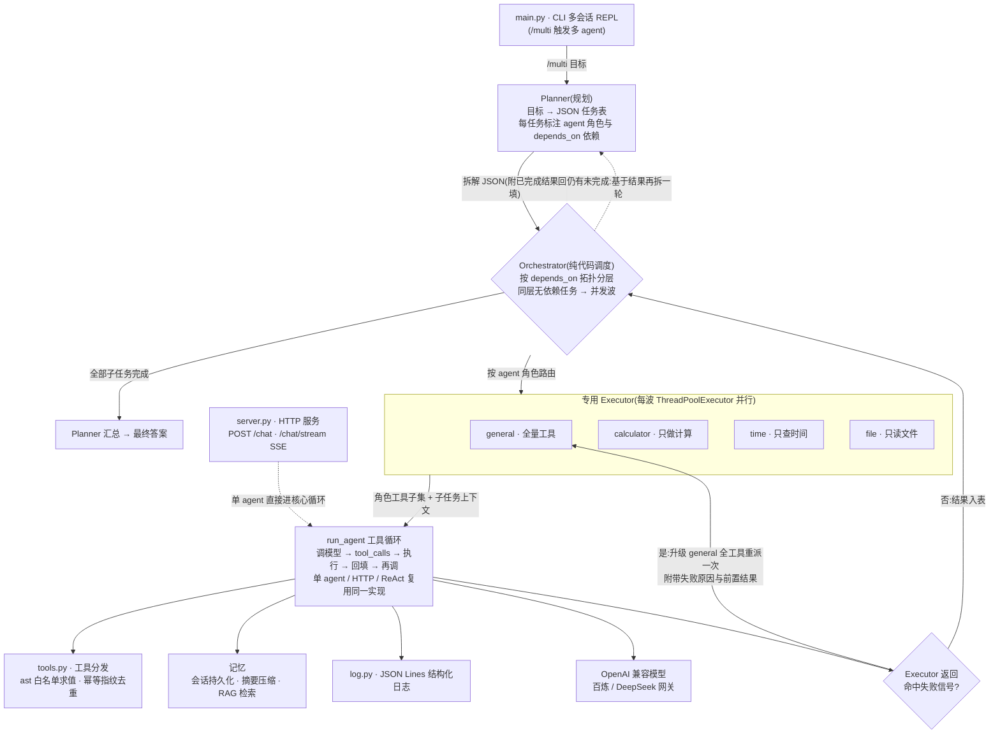

# agent-lab · 可恢复、可观测的多范式 Agent 运行时

一套用于验证 Agent 编排取舍的 Python 实验场。早期实现保持框架中立，显式处理工具循环、会话记忆、
RAG、Planner–Executor 和 ReAct；随后保留手写 V1 作为行为基线，引入 LangGraph V2 研究状态图、
并行 DAG、持久恢复、人工介入和运行时观测。模型、工具、编排、治理与评测边界均可单独替换。

三种执行范式(原生 tool calling / Planner+Executor / ReAct)、两级长期记忆、多专用 Executor 协作、
失败自愈重派、拓扑并行、eval 端到端打分。测试使用 mock 模型验证逻辑，`python evaluate.py` 真调 API 做端到端评测。

## 设计概览

| 维度 | 当前实现 | 可复查证据 |
|---|---|---|
| 控制流透明度 | 手写 V1 显式处理模型调用、工具执行、Observation 回填、终止与 ReAct | `agent.py`、`react.py` |
| 编排模型 | LangGraph V2 显式实现 State/Node/Edge/Reducer，不依赖一行式高层封装 | `langgraph_agent.py` |
| DAG 并发 | `depends_on` 就绪集 + `Send` 并行 + 按 task_id 合流 Reducer | `langgraph_multiagent.py` |
| 持久恢复 | SQLite checkpoint + thread_id 跨进程恢复；已提交任务不重跑 | `tests/test_checkpoint_resume.py` |
| 敏感操作 | 工具执行前 interrupt，支持 approve/reject/edit | `hitl.py` |
| 观测与评测 | 节点 span、状态增量、结构化 SSE、V1/V2 共用 Eval | `observability.py`、`reports/` |

已验证结果：17 个离线测试文件全部通过；8 类场景 × 2 版本 × 3 次共 48 次确定性运行满足预期；
每版 39 次工具请求实际执行 36 次；独立进程恢复实验中已完成工具的重复执行由 V1 的 2 次降为 V2 的 0 次。
这些是 Mock 控制流与恢复证据，不代表真实模型成功率、Token 成本或线上延迟。

技术索引：[最终架构](docs/系统架构与演进.md) ·
[技术调研与演进](docs/技术调研与演进记录.md) ·
[V1/V2 评测方法](docs/V1V2对比评测.md) ·
[可观测设计](docs/可观测与结构化SSE.md)

## 工程演进摘要

当前实现从单 Agent 显式状态循环演进到多 Agent DAG 并发，
并加入 SQLite checkpoint、跨进程断点恢复、节点级可观测轨迹与结构化 SSE。设计取舍见
[`docs/技术调研与演进记录.md`](docs/技术调研与演进记录.md)。

多 Agent 节点化阶段将系统拆成 `Planner -> Executor 子图 -> Summarizer`：Executor 为每个角色复用
基础单 Agent 图并绑定最小工具集，父/子图通过显式状态适配传递任务与真实结果。

DAG 调度阶段增加 `scheduler + Send + Reducer`：按 `depends_on` 就绪集分波执行，默认最多 4 个
Executor 并发；每波合流后放行下一波。失败任务记录原因并阻塞依赖后继，独立分支继续完成。
运行入口仍是 `/graph-multi`，终端按波次展示调度信息。源码讲解与运行示例见
[`docs/DAG并行调度.md`](docs/DAG并行调度.md)。

持久恢复阶段将官方 `SqliteSaver` 注入父图，以 `thread_id` 保存每个 superstep。CLI 可在 Executor
波次后暂停并在程序重启后继续；已有线程禁止重新 start，完成态 resume 不重跑模型和工具。
实现与一致性边界见 [`docs/SQLite断点恢复.md`](docs/SQLite断点恢复.md)。

人工介入阶段新增独立 `/hitl-*` 审批入口：`read_file` 在执行前以动态 `interrupt()` 暂停，人工可
approve、reject 或 edit 参数，再通过 SQLite checkpoint 恢复。完整说明见
[`docs/HITL敏感工具审批.md`](docs/HITL敏感工具审批.md)。

执行治理阶段将策略下沉到共享基础层：文件读取强制根目录白名单，持久化 ID 统一校验，session/RAG
采用原子写与并发事务锁，模型和工具增加超时，工具增加全局并发上限。详见
[`docs/安全与并发治理.md`](docs/安全与并发治理.md)。

对比评测阶段新增 V1/V2 共用评测器，48 次离线运行通过；独立进程恢复实验中 V1 重跑已完成工具 2 次、
V2 为 0。真实 API 评测入口已提供，但本次 Token/真实模型质量未实测。阅读
[评测设计说明](docs/V1V2对比评测.md) 与 [离线对比报告](reports/offline-eval.md)。

可观测阶段新增图外 `RunObserver`：统一记录 `run/node start/end/error`、状态增量与节点耗时，兼容
Send 并行分支且不改变 checkpoint schema；`/graph/stream` 实时推送执行轨迹，原 `/chat/stream`
也升级为 `session/delta/error/done` JSON 事件。阅读
[可观测设计说明](docs/可观测与结构化SSE.md) 与 [离线轨迹示例](reports/offline-trace.md)。

收口阶段补齐最终架构、已知边界与 `verify_offline.py` 离线验收入口，确保轨迹、恢复、审批、SSE
和基准报告可以在无网络、无 API Key 的环境中重复验证。

```powershell
# 不读取 .env、不请求 API；生成 reports/offline-eval.json 和 .md
.venv\Scripts\python.exe -X utf8 eval_compare.py --mode offline --repeats 3
# 以下命令会请求真实模型并消耗 API 额度
.venv\Scripts\python.exe -X utf8 eval_compare.py --mode live --repeats 3

# 不请求 API，实时显示节点并生成 reports/offline-trace.json 和 .md
.venv\Scripts\python.exe -X utf8 trace_cli.py "计算 (12+8)*3" --offline-demo --output reports\offline-trace
```

---

## 特性

- **单 agent**:原生 tool calling 工具循环,reasoning(Thought)与 tool_calls(Action)双通道合流,流式输出。
- **两级记忆**:会话持久化到 JSON + 摘要压缩(长期记忆)+ 手写向量库 RAG 精确取回细节。
- **多 agent**:Planner 把目标拆成带依赖声明的任务表 → Orchestrator 拓扑分层、同层并行 → 多专用
  Executor(各持最小工具子集,能力最小化);Executor 返回失败信号时自动升级通用角色重派一次。
- **ReAct**:Thought/Action/Observation 纯文本协议循环,与原生 tool calling 对比可见。
- **工具层**:schema 即说明书、`ast` 白名单安全求值、幂等白名单 + 参数指纹去重。
- **工程面**:JSON Lines 结构化日志、FastAPI 一次性 + 结构化 SSE、eval 质量层、mock 模型测试套件。
- **可恢复执行**:SQLite checkpoint + `thread_id` 隔离，支持跨进程恢复、状态查询和完成态幂等 resume。
- **人工审批**:`read_file` 敏感调用执行前暂停，支持批准、拒绝与修改参数，决策写入执行轨迹。
- **安全治理**:路径白名单、持久化 ID 校验、原子写、同 session 串行事务、工具超时与并发限流。
- **节点可观测**:统一 run/span 事件、状态增量压缩、节点耗时、失败定位、JSON/Markdown 轨迹导出。
- **结构化 SSE**:`/chat/stream` 和 `/graph/stream` 均以命名事件 + JSON 传输，异常不会静默结束。

---

## 快速开始

### 1. 安装与配置

```bash
python -m venv .venv
pip install -r requirements.txt

# Windows: 把 .env.example 复制成 .env,填入 key 后运行自检
# copy .env.example .env
python _check_config.py
```

`.env` 关键项(OpenAI 兼容客户端,网关可换):

| 变量 | 说明 |
|---|---|
| `OPENAI_API_KEY` | 你的模型 key(百炼 `sk-` 开头,或你的网关) |
| `OPENAI_BASE_URL` | 网关地址,如百炼兼容端点 `https://dashscope.aliyuncs.com/compatible-mode/v1` |
| `OPENAI_MODEL` | 模型名,如 `qwen3.7-flash` / `deepseek-v4-flash` |
| `DASHSCOPE_API_KEY` | RAG embedding 用(百炼 `text-embedding-v4`) |

> 大陆直连需代理时,把 `.env.example` 里的 `HTTP_PROXY/HTTPS_PROXY` 打开填你的 Clash 端口。

### 2. 跑起来

```bash
# CLI 多会话 REPL(直接提问走单 agent;/multi 多 agent;/react ReAct;/thinking 显示 Thought)
python main.py
# CLI 内输入 /graph <问题>，运行 LangGraph 显式状态图版
# CLI 内输入 /graph-multi <目标>，运行 LangGraph DAG 并行多 Agent
# CLI 内输入 /checkpoint-start demo | <目标>，随后用 /checkpoint-resume demo 跨进程续跑
# CLI 内输入 /hitl-start review | <问题>，随后用 /hitl-approve、/hitl-reject 或 /hitl-edit 审批

# HTTP 服务(一次性 + 结构化 SSE)
python -m uvicorn server:app --port 8000
# curl 测试(Windows PowerShell 请用 curl.exe 或 Invoke-RestMethod):
# curl -X POST localhost:8000/chat -H "content-type: application/json" -d '{"question":"现在几点"}'
# curl -N -X POST localhost:8000/chat/stream -H "content-type: application/json" -d '{"question":"现在几点"}'
# curl -N -X POST localhost:8000/graph/stream -H "content-type: application/json" -d '{"question":"计算 1+2","mode":"single"}'

# 节点轨迹 CLI：默认请求真实模型；加 --mode multi 可观察 DAG
python trace_cli.py "计算 1+2" --output reports\latest-trace

# 离线验收总入口；--quick 只验证轨迹和可观测层
python verify_offline.py --quick

# eval 端到端打分(真调 API,打印用例级 PASS/FAIL)
python evaluate.py
```

### 3. 测试(不调 API,mock 模型,全绿)

```bash
# Git Bash / Linux / macOS 统一运行全部测试文件
for t in tests/test_*.py; do python "$t"; done

# Windows PowerShell
# Get-ChildItem tests/test_*.py | ForEach-Object { python $_ }
```

逐文件对应:

| 测试文件 | 覆盖 |
|---|---|
| `test_memory.py` | 会话持久化 + 摘要压缩 |
| `test_rag.py` | 手写向量库真测 + RAG 注入 |
| `test_multi.py` | 多agent:拆解/执行/失败自愈/depends_on 并行 |
| `test_react.py` | ReAct 解析器 + 循环 + 去重 |
| `test_reasoning.py` | 合流:reasoning 捕获 + 不回填 |
| `test_streaming.py` | 流式重建 tool_calls |
| `test_dedup.py` | 工具幂等去重 |
| `test_eval.py` | eval 打分逻辑 |
| `test_server.py` | HTTP 层:一次性 + 结构化 SSE + 图轨迹流 + 异常事件 |
| `test_langgraph_agent.py` | LangGraph 显式状态/条件路由/工具闭环/去重/异常/终止 |
| `test_langgraph_multiagent.py` | LangGraph Planner/Executor 子图/Summarizer/最小权限/重派 |
| `test_langgraph_dag.py` | Send 真并发、合流、上下文隔离、失败阻塞、非法 DAG、循环预算 |
| `test_checkpoint_resume.py` | SQLite 落盘、跨进程断点恢复、thread_id 校验、完成任务不重跑 |
| `test_hitl.py` | 敏感工具 approve/reject/edit、审批前零执行、非敏感工具直通 |
| `test_governance.py` | 路径穿越、原子写故障、并发会话/RAG、工具超时与限流 |
| `test_eval_compare.py` | 配对场景、错工具/缺回填/提前合流反例、usage 缺失、离线阻网 |
| `test_observability.py` | 节点跨度、状态增量、失败定位、并行事件线程安全、轨迹导出 |

DAG 测试显式禁用 socket 连接与云追踪，可单独离线运行：

```powershell
.venv\Scripts\python.exe -X utf8 tests\test_langgraph_dag.py
.venv\Scripts\python.exe -X utf8 tests\test_checkpoint_resume.py
.venv\Scripts\python.exe -X utf8 tests\test_hitl.py
.venv\Scripts\python.exe -X utf8 tests\test_governance.py
.venv\Scripts\python.exe -X utf8 tests\test_eval_compare.py
.venv\Scripts\python.exe -X utf8 tests\test_observability.py
```

`test_memory.py` 与 `test_rag.py` 同时替换聊天模型和 embedding，避免“对话模型已 mock、RAG
仍访问网络”的假离线测试。

---

## 架构

三种范式共享同一个核心循环。下图是多 agent(`/multi`)一次请求的运行时路径——
单 agent(CLI 直接提问 / HTTP `/chat`)只是绕过 Planner 与 Orchestrator,直接进入 `run_agent` 循环;
ReAct 则是用自己的文本协议循环,执行仍走同一套工具层。



**关键设计**:

- **一个核心循环,三种范式复用**:`run_agent` 是唯一的工具执行者。多 agent 的 Executor 不重写循环,
  只是以"角色工具子集 + 角色 system prompt"调用 `run_agent`;ReAct 用自己的文本协议循环,但工具执行、
  日志、幂等去重都复用工具层。分层复用是这套代码能保持小的原因。
- **依赖显式化 + 拓扑并行**:Planner 在任务 JSON 里声明 `depends_on`,Orchestrator 按声明把本批任务
  排成"波"——同波内任务互不依赖 → 线程池并行;依赖跨层 → 波间串行。`stream=True` 时降级串行
  (流式是单通道回调,并发写会交织)。
- **多专用 Executor = 声明式角色注册表**:每个角色就是一条"工具子集 + 系统提示"的配置,新增角色只加
  一条。能力最小化:文件角色拿不到计算器,天然无法越权;系统提示同时声明能力边界,任务超范围就明确
  拒绝而不是编造。
- **三级可靠性**:Planner 分批提示(软)→ Orchestrator 前置结果注入(软)→ Executor 失败信号命中时
  升级全工具的 general 重派一次(硬,只一次,绝不死循环)。
- **记忆两级互补**:摘要压缩给全局概览、控制 token;RAG(手写向量库,百炼 embedding)按需取回精确细节。
  摘要丢的细节由向量检索兜住。
- **eval 与测试分层**:单测全部 mock 模型,验证的是"逻辑正确";`evaluate.py` 真调 API,验证的是
  "端到端行为"(会不会用对工具、答案对不对)。两层互补。

---

## 模块导览

| 模块 | 职责 | 设计要点 |
|---|---|---|
| `agent.py` | 核心工具循环 + 会话记忆 + 流式 + 幂等去重 + 合流(reasoning 捕获) | while 循环本质、压缩阈值、tool_calls 重建、Thought 不回填 |
| `langgraph_agent.py` | LangGraph V2 单 Agent 编排 | 显式 State、节点/条件边、轨迹、依赖注入、循环上限 |
| `langgraph_multiagent.py` | LangGraph V2 多 Agent 编排 | DAG 校验、scheduler、Send、结果 Reducer、失败阻塞、角色子图 |
| `checkpointing.py` | SQLite 持久化运行器 | thread_id、start/resume/status、静态断点、完成态幂等 |
| `hitl.py` | 敏感工具人工审批入口 | 动态 interrupt、approve/reject/edit、SQLite 恢复 |
| `governance.py` | 共享安全与执行治理 | 路径/ID 校验、原子写、事务锁、超时与并发限流 |
| `eval_compare.py` / `eval_scenarios.py` | V1/V2 配对评测 | 离线/真实模型、轨迹评分、Token 口径、JSON/Markdown 报告 |
| `eval_recovery.py` | 独立进程恢复实验 | 固定中断位置、新进程续跑、台账判重 |
| `observability.py` / `trace_cli.py` | 节点可观测与演示入口 | span、状态增量、耗时、失败位置、JSON/Markdown 导出 |
| `tools.py` | 工具 schema / `run_tool` 分发 / `_safe_eval` / 幂等指纹 | schema 即说明书、eval 注入攻击、幂等声明与指纹 |
| `multiagent.py` | Planner + 多专用 Executor + Orchestrator | 两级拆解、最小权限、依赖 DAG、失败自愈、批内并行 |
| `react.py` | ReAct 文本协议循环 | Thought/Action/Observation、解析器鲁棒性、三层兜底 |
| `memory.py` | 会话持久化到 JSON + 摘要压缩 | state vs 短期/长期记忆 |
| `rag.py` | 手写向量库(numpy 余弦)+ 百炼 embedding | 为什么手写、检索注入、与摘要互补 |
| `log.py` | JSON Lines 结构化日志 + 终端可读 | 可聚合、可审计、流式时序 |
| `evaluate.py` | eval 端到端打分 | 双层质量:单测 mock 验逻辑 + eval 真调验行为 |
| `server.py` | FastAPI 一次性 + 结构化 SSE | 同步核心接异步传输、错误事件与正常收尾 |
| `verify_offline.py` | 离线验收总入口 | 轨迹、恢复、审批、SSE 与基准指标一致性 |

## 目录结构

```
agent-lab/
├── agent.py        # 核心工具循环(单 agent / 多 agent Executor / HTTP 共用)
├── langgraph_agent.py      # LangGraph 单 Agent 状态图
├── langgraph_multiagent.py # LangGraph 多 Agent DAG 父图与角色子图
├── checkpointing.py        # SQLite checkpoint 与 thread_id 恢复入口
├── hitl.py                 # read_file 动态 interrupt 与人工审批
├── observability.py        # 图外节点 span、状态增量、耗时与失败事件
├── trace_cli.py            # 实时观察与 JSON/Markdown 轨迹导出
├── verify_offline.py       # 一键离线验收与基准报告一致性检查
├── governance.py           # 路径、标识、原子写、超时与限流
├── tools.py        # 工具层:schema、分发、安全求值、幂等指纹
├── multiagent.py   # Planner + 多专用 Executor + Orchestrator(依赖并行/失败自愈)
├── react.py        # ReAct 文本协议循环
├── memory.py       # 会话持久化 + 摘要压缩
├── rag.py          # 手写向量库 + 百炼 embedding
├── log.py          # JSON Lines 结构化日志
├── main.py         # CLI 入口:多会话 REPL(/multi /react /thinking)
├── server.py       # FastAPI:POST /chat + 结构化 SSE /chat/stream、/graph/stream
├── evaluate.py     # eval 端到端打分
├── _check_config.py# 配置自检
├── tests/          # 单/多 Agent、记忆、接口与 DAG 调度测试
├── docs/           # 架构、工程演进、恢复/治理/评测设计记录
├── .env.example    # 配置模板(复制为 .env)
└── requirements.txt
```
