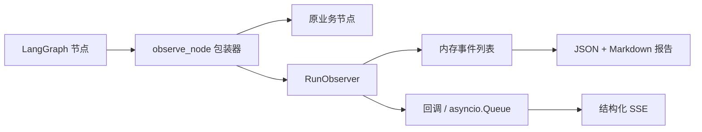

# 节点可观测、轨迹导出与结构化 SSE

## 1. 今天解决了什么

已有 `trace` 能判断业务行为是否正确，但它属于 Agent State，只记录节点主动写入的业务事件：
它没有统一时钟，无法回答“哪个节点慢”，节点抛异常时也可能来不及把失败写回 State。

图外 `RunObserver` 把一次运行统一表示为：

```text
run_start
  -> node_start(model)
  -> node_end(model, duration_ms, state_delta)
  -> node_start(tools)
  -> node_end(tools, duration_ms, state_delta)
  -> ...
run_end(completed | failed)
```

最终可同时得到三种消费方式：终端实时输出、JSON/Markdown 报告、HTTP SSE 实时事件。

## 2. 为什么观察器不放进 AgentState



`RunObserver` 持有线程锁、回调和高精度时钟，这些对象不应进入可序列化 State。观察器通过图构建函数的
闭包注入，只包裹节点调用；节点输入、输出、checkpoint schema 和路由条件均保持不变。因此
SQLite checkpoint 无需迁移，interrupt 也仍由原工具节点负责。

## 3. 统一事件协议

每条事件都有：

- `schema_version`：事件协议版本；
- `run_id`、`seq`：关联一次运行，并给并行事件确定唯一顺序；
- `timestamp`、`elapsed_ms`：墙上时间和相对运行起点时间；
- `event`：`run_start`、`node_start`、`node_end`、`node_error` 或 `run_end`；
- `span_id`：配对同一次节点调用的 start/end；
- `node`、`started_ms`、`duration_ms`：节点位置与耗时；
- `state_delta` 或 `error`：成功时的状态变化，或失败类型与有限错误消息。

状态不会复制完整对话：`messages` 只保留数量与角色，工具调用只保留 ID/名称，任务表只保留 ID、角色、
依赖，答案只保留长度和短预览。这样轨迹能解释状态变化，也避免日志体积随上下文无限增长。

## 4. 单 Agent 与多 Agent 如何接入

`build_agent_graph(..., observer=...)` 包裹 `model/tools/force_stop`。多 Agent 父图包裹
`planner/scheduler/executor/summarizer`，Executor 子图包裹 `prepare/run_role/retry_general`，
角色单 Agent 再以 `role.<role>.model/tools` 命名。所有 Send 并行分支共享同一个观察器；锁只保护事件
序号和列表追加，不包围业务节点，所以不会把并行执行重新串行化。

节点异常先产生 `node_error`，再继续向上抛出；顶层 `run_observed_graph` 产生失败的 `run_end`。
这使模型、Planner 或工具外围故障都有明确位置。工具本身的可恢复异常仍由基础闭环回填模型，属于
成功完成的 `tools` span，但其业务 `trace.ok=false` 仍保留，两层语义互补。

## 5. 可运行入口

完全离线演示，不读取真实模型 API：

```powershell
.venv\Scripts\python.exe -X utf8 trace_cli.py "计算 (12+8)*3" `
  --offline-demo --output reports\offline-trace
```

终端会实时打印 START/END/ERROR，并生成：

- `reports/offline-trace.json`：机器可读的完整事件；
- `reports/offline-trace.md`：实际节点路径 Mermaid 图和节点时间表。

真实模型运行：

```powershell
.venv\Scripts\python.exe -X utf8 trace_cli.py "计算 1+2" --mode single
.venv\Scripts\python.exe -X utf8 trace_cli.py "查询时间并完成计算" --mode multi
```

## 6. SSE 从文本块升级为事件协议

`POST /chat/stream` 的事件顺序为：

| 事件 | JSON 数据 | 含义 |
|---|---|---|
| `session` | `session_id` | 客户端保存会话 ID |
| `delta` | `text` | 模型文本增量 |
| `error` | `type/message` | 后台线程失败，可选 |
| `done` | `status/session_id` | 明确成功或失败收尾 |

旧实现在线程 `finally` 中只发 `[DONE]`，异常会静默丢失。现在后台线程捕获错误并发送 `error`，随后仍发送
`done(status=failed)`；所有 data 都是单行 JSON，文本中的换行不会破坏 SSE 帧。

`POST /graph/stream` 的事件顺序为 `run -> trace* -> result|error -> done`。其中每个 `trace` data
就是统一观察事件，因此前端不需要另一套字段映射。

```powershell
python -m uvicorn server:app --port 8000
curl.exe -N -X POST http://localhost:8000/graph/stream `
  -H "content-type: application/json" `
  -d '{"question":"计算 1+2","mode":"single"}'
```

## 7. 离线验收

```powershell
.venv\Scripts\python.exe -X utf8 tests\test_observability.py
.venv\Scripts\python.exe -X utf8 tests\test_server.py
```

测试覆盖：工具闭环节点路径、状态增量、耗时字段、模型失败定位、20 路并行 span 的连续唯一序号、
JSON/Markdown 导出、普通流异常、图轨迹流成功与失败。所有模型均为 FakeClient，不请求真实 API。

## 8. 设计总结

> 我把业务轨迹和运行时遥测分成两层：业务 trace 进入 State，适合评测工具选择和恢复语义；
> RunObserver 位于图外，用 span 记录节点开始、结束、耗时、状态增量和异常，因此不污染 checkpoint。
> 多 Agent 的 Send 分支共享线程安全序号，但锁不包住业务执行，保留并行性。HTTP 层使用同一事件模型
> 输出结构化 SSE，修复了后台线程异常只返回 DONE 的可观测盲区。轨迹既能导出 JSON 做分析，也能生成
> Mermaid 与时间表用于演示。

最关键的取舍不是“多打几行日志”，而是明确两条边界：观察器故障不能改变业务结果；可恢复工具错误与
未捕获节点异常不能混为同一种失败。
