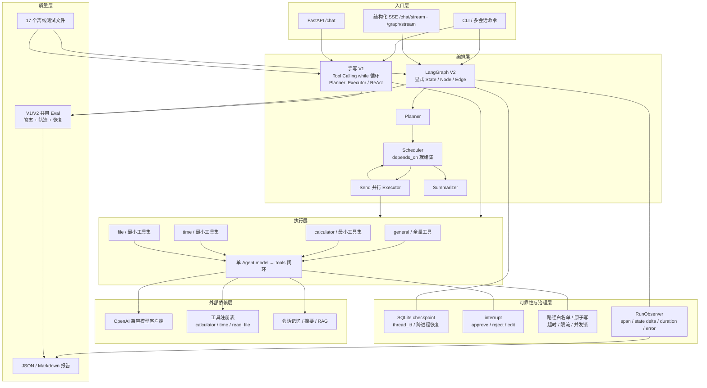
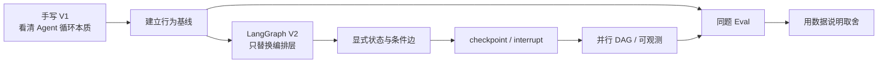
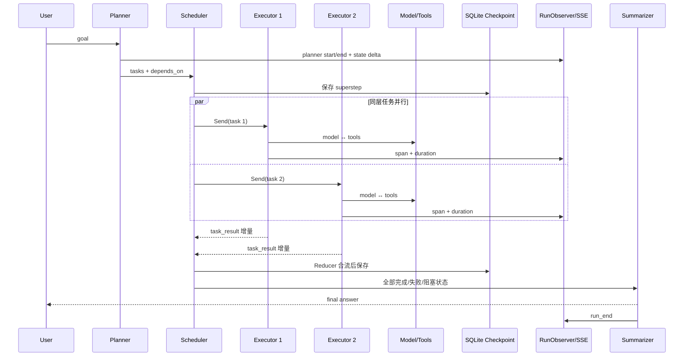

# Agent Lab 系统架构与 V1/V2 演进

## 1. 一张图看懂最终系统

## 2. 为什么保留 V1，而不是直接重写

V1 证明理解模型调用、工具参数、Observation 回填和终止条件；V2 解决长任务状态持久化、人工审批、
并行合流与节点观测。两版共享模型和工具边界，并用同一套场景评测，避免把提示词差异误当作框架收益。

## 3. V2 一次多 Agent 请求的控制流

## 4. 五个关键设计取舍

| 决策 | 选择 | 原因 | 代价/边界 |
|---|---|---|---|
| 编排迁移 | 保留 V1，仅把 V2 编排迁到 LangGraph | 能公平比较，也保留原理展示价值 | 两套编排需要共用契约测试 |
| 并行模型 | `depends_on` + 就绪集 + `Send` + Reducer | 同层并发、跨层串行，失败可传播 | Planner 输出必须严格校验 DAG |
| 恢复 | SQLite checkpoint + `thread_id` | 进程重启后从 superstep 继续 | 不承诺工具完成到 checkpoint 提交窗口的 exactly-once |
| 人工审批 | 敏感工具节点内 `interrupt` | 审批发生在副作用之前，可改参/拒绝 | interrupt 恢复时节点会重进，副作用必须放在 interrupt 后 |
| 可观测 | 图外 RunObserver + State 内业务 trace | 运行遥测不污染 checkpoint，评测语义仍可持久化 | 状态只保存摘要，完整内容需按安全策略另行记录 |

## 5. 代码阅读路线

1. `agent.py`：先理解手写 model → tools → model 闭环。
2. `langgraph_agent.py`：看同一循环如何映射为 State/Node/Edge。
3. `langgraph_multiagent.py`：看 Planner、Scheduler、Send、Reducer 和 Executor 子图。
4. `checkpointing.py`、`hitl.py`：看持久恢复与动态 interrupt。
5. `governance.py`：看路径、原子写、锁、超时与并发上限。
6. `observability.py`、`server.py`：看 span 如何进入报告与结构化 SSE。
7. `eval_compare.py`、`eval_recovery.py`：看 V1/V2 如何用同一口径比较。

## 6. 已验证能力与明确边界

- 17 个离线测试文件全部通过；模型和 embedding 均可替换，不依赖真实 API。
- 离线基准共 48 次确定性配对运行满足预期；模型请求 69 次/版本，工具请求 39 次、实际执行 36 次。
- 独立进程恢复实验中，V1 重复执行已完成工具 2 次，V2 为 0 次。
- 以上是确定性 Mock 回归证据，不代表开放问题上的真实模型正确率、线上延迟或 Token 成本。
- 恢复实验覆盖 checkpoint 已提交后的重启，不宣称任意副作用具备严格 exactly-once。
