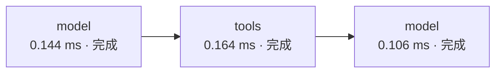

# Agent 运行轨迹（single）

## 节点事件完成顺序（并行以时间表为准）

## 节点时间线

| Seq | 节点 | 开始(ms) | 耗时(ms) | 状态 | 状态变化 / 错误 |
|---:|---|---:|---:|---|---|
| 3 | `model` | 27.107 | 0.144 | 完成 | {"messages":{"count":1,"roles":["assistant"]},"pending_tool_calls":[{"id":"demo-call-1","name":"calculator"}],"iteration":1,"answer":{"chars":0,"preview":""},"stop_reason":"","trace":{"count":1,"nodes":["model"]}} |
| 5 | `tools` | 28.265 | 0.164 | 完成 | {"messages":{"count":1,"roles":["tool"]},"pending_tool_calls":[],"tool_cache":{"entries":1,"keys":["calculator\|{\"expression\": \"(12+8)*3\"}"]},"trace":{"count":1,"nodes":["tools"]}} |
| 7 | `model` | 29.241 | 0.106 | 完成 | {"messages":{"count":1,"roles":["assistant"]},"pending_tool_calls":[],"iteration":2,"answer":{"chars":9,"preview":"计算结果是 60。"},"stop_reason":"completed","trace":{"count":1,"nodes":["model"]}} |
